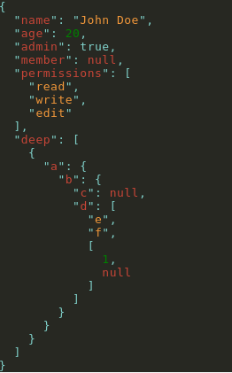
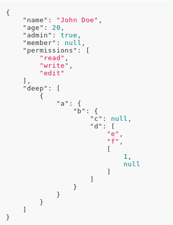

[](https://travis-ci.org/GuillaumeCisco/react-json-prettify)
[](https://coveralls.io/github/GuillaumeCisco/react-json-prettify?branch=master)

React Json Prettify
=========

Simple and Lightweight React Component for displaying Json.

The only dependencies are `react` and `prop-types` (last is excluded once built).

## Installation

  `npm install react-json-prettify`
  
  or
  
  `yarn add react-json-prettify`

## Usage

```javascript
import JSONPretty from 'react-json-prettify';

const json = {
    name: 'John Doe',
    age: 20,
    admin: true,
    member: null,
    permissions: ['read', 'write', 'edit'],
    deep: [
        {
            a: {
                b: {
                    c: null,
                    d: ['e', 'f', [1, null]],
                },
            },
        },
    ],
};
    
return <JSONPretty json={json} />
```
  
  
  Output will look like
  
  


There are only two simple `options`: `theme` and `padding`

```javascript
import JSONPretty from 'react-json-prettify';
import {github} from 'react-json-prettify/themes';

const json = {
    name: 'John Doe',
    age: 20,
    admin: true,
    member: null,
    permissions: ['read', 'write', 'edit'],
    deep: [
        {
            a: {
                b: {
                    c: null,
                    d: ['e', 'f', [1, null]],
                },
            },
        },
    ],
};
    
return <JSONPretty json={json} theme={github} padding={4} />
```

  

Modifying the padding will modify the numbe of spaces to indent.

Regarding themes, this modules come with 81 themes.  
For the main part, they come from [highlightjs](https://highlightjs.org/static/demo/)  
Do not hesitate to play with them.

Overriding a theme to your needs is very easy. And you can control most of the part of the render.  
For example:

```javascript
import {atomOneLight} from 'react-json-prettify/dist/themes';

const customTheme = {
    ...atomOneLight,
    valueQuotes: 'rgb(140, 153, 165)',
    value: {
        ...atomOneLight.value,
        string: 'rgb(140, 153, 165)',
    },
};
```

All the themes derive from the same simple architecture:

```javascript
export default {
    background: 'rgb(39, 40, 34)',
    brace: 'rgb(129, 211, 204)',
    keyQuotes: 'rgb(129, 211, 204)',
    valueQuotes: 'rgb(129, 211, 204)',
    colon: 'rgb(129, 211, 204)',
    comma: 'rgb(129, 211, 204)',
    key: 'rgb(201, 70, 56)',
    value: {
        string: 'rgb(242, 152, 59)',
        null: 'rgb(201, 70, 56)',
        number: 'green',
        boolean: 'rgb(129, 211, 204)',
    },
    bracket: 'rgb(129, 211, 204)',
};

```

Themes only support colors for now.  
Simply use basic css color values. 

## Tests

  `npm test`

## Contributing

In lieu of a formal style guide, take care to maintain the existing coding style. Add unit tests for any new or changed functionality. Lint and test your code.

## TODO

More css customization (background-color, background-url, font-weight).  
Styles of brackets and braces.  
Inline options for arrays.